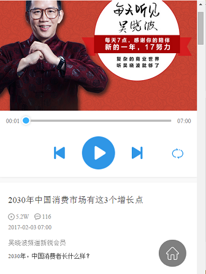
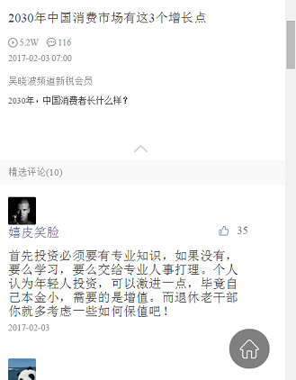
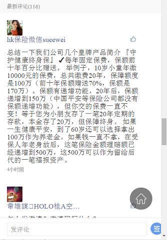

# 一些操作说明

## 如何查看REST API文档

1. 打开网页 http://petstore.swagger.io/
2. 在顶部的输入框输入yaml文件在github的地址： https://raw.githubusercontent.com/Calvin-he/conigtive_english/master/design_docs/%E8%AE%A4%E7%9F%A5%E8%8B%B1%E8%AF%AD%E5%BE%AE%E4%BF%A1%E5%BC%80%E5%8F%91API.yaml 
3. 点击explore， 点击default

## 需求说明演示

1. 列表页面截图：
    > 
    > 
2. 课程页面截图
    > 
    > 
    > 
